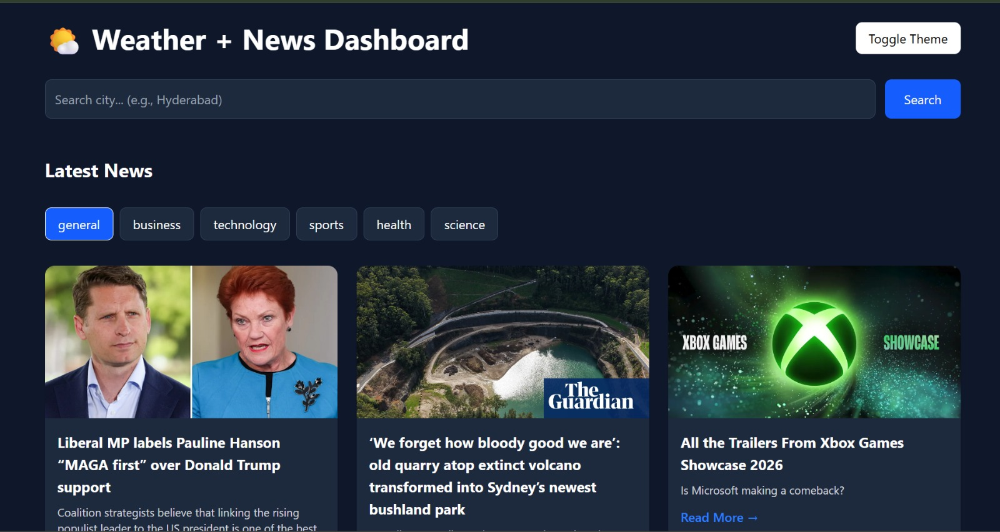
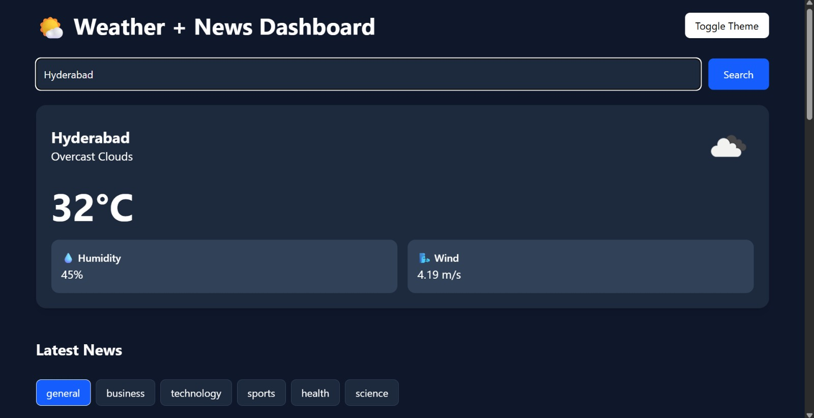
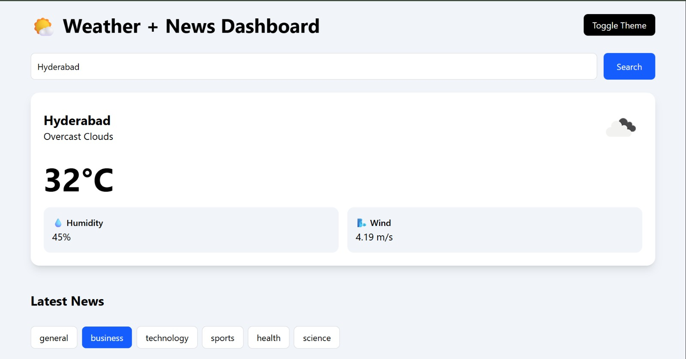

# 🌤 Weather + News Dashboard (SPA)

## Overview
**Weather + News Dashboard** is a modern, single-page application (SPA) built using React[cite: 1, 2]. It allows users to check real-time weather information by city search and browse the latest news by category in a single, unified, and highly responsive interface[cite: 1, 2].

The project demonstrates robust API integration, clean component-based architecture, global state management, dark/light mode toggles, and seamless responsive UI design[cite: 1, 2].

---

## 📸 Screenshots

### Home / Dashboard View
[cite: 1, 2]

### Weather Section
[cite: 1, 2]

### News Section
[cite: 1, 2]

### Dark Mode View
[cite: 1, 2]

---

## ✨ Features

- **Real-time Weather Search:** Dynamic lookup using the OpenWeatherMap API[cite: 1, 2].
- **News Feed with Filtering:** Browse and filter the latest headlines by category (NewsAPI / GNews)[cite: 1, 2].
- **Dark / Light Mode Toggle:** Seamless UI theme switching[cite: 1, 2].
- **Persistent Theme:** Saves user choice via `localStorage` to retain preferences on reload[cite: 1, 2].
- **UX Enhancements:** Sleek Skeleton Loaders render during asynchronous API calls[cite: 1, 2].
- **Graceful Error Handling:** Descriptive feedback for invalid city inputs or API rate limits/failures[cite: 1, 2].
- **Fully Responsive Design:** Optimized layouts for mobile, tablet, and desktop screens[cite: 1, 2].
- **Clean Architecture:** Fully modular component-based structure using React best practices[cite: 1, 2].

---

## 🛠 Technologies Used

### Frontend
- **React.js** (Functional Components, Hooks)[cite: 1, 2]
- **Vite** (Next-generation frontend tooling)[cite: 1, 2]
- **Tailwind CSS** (Utility-first styling & dark mode configurations)[cite: 1, 2]
- **Axios** (Promise-based HTTP client)[cite: 1, 2]
- **Context API** (Global state management for theming)[cite: 1, 2]

### External APIs
- **OpenWeatherMap API** (Current Weather Data)[cite: 1, 2]
- **NewsAPI / GNews API** (Top Headlines Data)[cite: 1, 2]

---

## 📂 Project Structure

```text
weather-news-dashboard/
│
├── src/
│   ├── components/
│   │   ├── WeatherSearch.jsx   # Input field and logic for city search
│   │   ├── WeatherCard.jsx     # Displays formatted weather metrics
│   │   ├── NewsCard.jsx        # Displays individual news article items
│   │   ├── NewsFilter.jsx      # Category navigation selectors
│   │   └── Loader.jsx          # Skeleton screens for loading states
│   │
│   ├── context/
│   │   └── ThemeContext.jsx    # Context & Provider for managing theme state
│   │
│   ├── hooks/
│   │   └── useWeather.js       # Custom React hook for encapsulation of weather logic
│   │
│   ├── pages/
│   │   └── Dashboard.jsx       # Core layout connecting modules together
│   │
│   ├── services/
│   │   ├── weatherService.js   # API client instance configuration for Weather
│   │   └── newsService.js      # API client instance configuration for News
│   │
│   └── main.jsx                # Application entry point
│
├── index.html
├── package.json
├── vite.config.js
└── README.md
```[cite: 1, 2]

---

## ⚙️ Module Breakdowns

### 🌦 Weather Module
- Search weather dynamically by typing a city name[cite: 1, 2].
- Displays vital weather parameters: Temperature, Humidity, Wind Speed, and Atmospheric Conditions[cite: 1, 2].
- Handled efficiently with asynchronous API fetching[cite: 1, 2].

### 📰 News Module
- Filter articles by specific categories (e.g., Business, Technology, Sports, Health)[cite: 1, 2].
- Displays clean article cards containing images, headlines, snippets, and direct source links[cite: 1, 2].

### 🌗 Theme System
- Global system utilizing React Context API[cite: 1, 2].
- Listens to system preferences on initial load or falls back to saved `localStorage` values[cite: 1, 2].
- Implemented natively through Tailwind's `dark:` utility classes[cite: 1, 2].

---

## 🚀 Installation and Setup

Follow these steps to set up the project locally:

### 1. Clone the Repository
```bash
git clone [https://github.com/your-username/weather-news-dashboard.git](https://github.com/your-username/weather-news-dashboard.git)
cd weather-news-dashboard
```[cite: 1, 2]

### 2. Install Dependencies
```bash
npm install
```[cite: 1, 2]

### 3. Configure Environment Variables
Create a `.env` file in the root directory of your project and populate it with your personal API credentials[cite: 1, 2]:

```env
VITE_WEATHER_API_KEY=your_openweathermap_api_key
VITE_NEWS_API_KEY=your_news_api_key
```[cite: 1, 2]

### 4. Run Development Server
```bash
npm run dev
```[cite: 1, 2]
The application will be accessible at `http://localhost:5173` by default[cite: 1, 2].

### 5. Build for Production
```bash
npm run build
```[cite: 1, 2]

---

## 🎓 Assignment Requirements Covered

- [x] **Core Features:** Weather API integration, News API integration, City search mechanism, Category-based news filtering[cite: 1, 2].
- [x] **State & Persistency:** Theme system driven by React Context API, stored locally inside `localStorage`[cite: 1, 2].
- [x] **UI/UX Checklist:** Interactive skeleton loading layouts, comprehensive layout responsiveness, modular architecture, and descriptive error banners[cite: 1, 2].

---

## 🔮 Future Enhancements

- **Auto-suggest City Search:** Integration of a Geocoding autocomplete dropdown for the city input fields[cite: 1, 2].
- **Geolocation Support:** Automatic weather detection based on user permission and GPS coordinates[cite: 1, 2].
- **News Search bar:** Text search query parameters to look up custom articles outside default categories[cite: 1, 2].
- **Progressive Web App (PWA):** Enable offline viewing capabilities and asset caching[cite: 1, 2].
- **Advanced Animations:** Frame-by-frame transitions using Framer Motion for smooth component transitions[cite: 1, 2].
- **Bookmarks Feature:** Allow saving favorite cities or pinning specific news articles[cite: 1, 2].

---

## 👤 Author

**Your Name** *Full Stack Developer* - **GitHub:** [YMeenakshi23](https://github.com/YMeenakshi23)[cite: 1, 2]

---

## 📄 License
This project is open-source and developed primarily for educational and assessment purposes[cite: 1, 2].